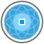
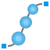
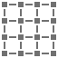
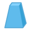

# Fusion 360 Jewelry Toolkit

A small collection of utilities that speed up jewelry modeling in Fusion 360. The add-in adds specialized commands for gemstone placement, prong creation, channels, cutters, body patterning along paths, free-form deformation, tapering, and surface manipulation.

             

## ⚠️ Important
Command creation and editing work correctly only with **Hybrid Design Type**. Part and Assembly design types may have limitations. Ensure you're using Hybrid Design for full functionality of all commands.

## Installation
1. In Fusion 360, go to Utilities → Add-ins → Scripts and Add-ins.
2. Click the `+` button and choose "Script or Add-in from my computer".
3. Select the `FusionJewelryToolkit` folder and click Open.
4. To make the add-in run automatically when Fusion starts, enable the "Run on Startup" checkbox.
5. After installation, the commands will appear in the Utilities tab instead of the Solid → Create panel.

Note: This add-in uses the Custom Feature Fusion API, which is currently in preview. Future Fusion 360 updates may require changes to the add-in.

## What's new
- **FFD (Early Preview):** New command for free-form deformation of a solid body using an editable 3D control lattice with per-point XYZ offsets.
- **Taper (Early Preview):** New command for creating an editable tapered copy of a solid body along a selected axis with a configurable pivot point and angle.
- **Shared deformation infrastructure:** Added reusable NURBS-based body deformation helpers and custom feature base-feature lookup for the new deformation workflows.
- **Improved command UX and validation:** Added reset confirmation for FFD and shared axis-direction extraction for construction axes, linear edges, and sketch lines.
- See [full changelog](CHANGELOG.md) for complete version history.

---

## GemstonesOnFaceAtPoints — Place round gemstones on a face at specified points
- **Description:** Creates round-cut gemstone bodies at selected points on a chosen face or construction plane. Supports sketch points, vertices, and construction points.
- **Selection:** 1 face or construction plane and one or more points (sketch points, vertices, or construction points). The face/plane may have any curvature or complexity; the points do not need to lie directly on the face/plane.
- **Key parameters:**
  - **Size** — Gemstone diameter. Default: `1.5 mm`. Determines the overall size of the gemstone.
  - **Flip Gemstones** — Flip gemstone orientation. Reverses the direction the gemstone faces relative to the surface. Default: `false`.
  - **Flip Face Normal** — Flip gemstone relative to face normal. Rotates the gemstone 180 degrees around the face normal. Default: `false`.
  - **Absolute Depth Offset** — Additional depth offset in absolute units. Adds a fixed depth to the gemstone beyond the relative offset. Default: `0 mm`.
  - **Relative Depth Offset** — Depth offset as a fraction of gemstone size. Controls how deep the gemstone sits (0.1 = 10% of diameter). Default: `0`.

---

## GemstonesOnFaceAtCircles — Place round gemstones on a face at sketch circles
- **Description:** Creates round-cut gemstone bodies at selected sketch circles on a chosen face or construction plane. The gemstone size matches the circle diameter.
- **Selection:** 1 face or construction plane and one or more sketch circles. The face/plane may have any curvature or complexity; the circles do not need to lie directly on the face/plane. Minimum circle diameter is `0.5 mm`.
- **Key parameters:**
  - **Flip Gemstones** — Flip gemstone orientation. Reverses the direction the gemstone faces relative to the surface. Default: `false`.
  - **Flip Face Normal** — Flip gemstone relative to face normal. Rotates the gemstone 180 degrees around the face normal. Default: `false`.
  - **Absolute Depth Offset** — Additional depth offset in absolute units. Adds a fixed depth to the gemstone beyond the relative offset. Default: `0 mm`.
  - **Relative Depth Offset** — Depth offset as a fraction of gemstone size. Controls how deep the gemstone sits (0.1 = 10% of diameter). Default: `0`.

---

## GemstonesOnFaceAtCurve — Place gemstones along a curve with variable sizes
- **Description:** Creates round-cut gemstone bodies along a selected curve (sketch curve or model edge) on one or more selected faces or construction planes. Gemstone sizes can gradually change from start to end, and each gemstone is attached to the closest selected support.
- **Selection:** 1 or more faces or construction planes, and 1 curve (sketch curve or edge).
- **Key parameters:**
  - **Start Offset** — Distance from the curve start to the first gemstone. Default: `0 mm`.
  - **End Offset** — Distance from the curve end to the last gemstone. Default: `0 mm`.
  - **Flip Curve** — Flip gemstone placement direction. Starts placing gemstones from the opposite end of the curve. Default: `false`.
  - **Start Size** — Gemstone diameter at the curve start. Default: `1.0 mm`. Minimum: `0.5 mm`.
  - **End Size** — Gemstone diameter at the curve end. Default: `0.7 mm`. Minimum: `0.5 mm`.
  - **Size Step** — Size discretization step. Gemstone sizes are rounded to multiples of this value. Default: `0.05 mm`. Range: `0–1.0 mm`.
  - **Target Gap** — Target distance between adjacent gemstones along the curve. Default: `0.1 mm`.
  - **Uniform Distribution** — Distribute gemstones uniformly along the curve. Ensures gemstones fill the entire available length from start offset to end offset without gaps at the ends. Default: `false`.
  - **Flip Gemstones** — Flip gemstone orientation. Reverses the direction the gemstone faces relative to the surface. Default: `false`.
  - **Flip Face Normal** — Flip gemstone relative to face normal. Rotates the gemstone 180 degrees around the face normal. Default: `false`.
  - **Absolute Depth Offset** — Additional depth offset in absolute units. Adds a fixed depth to the gemstone beyond the relative offset. Default: `0 mm`.
  - **Relative Depth Offset** — Depth offset as a fraction of gemstone size. Controls how deep the gemstone sits (0.1 = 10% of diameter). Default: `0`.

---

## GemstonesOnFaceBetweenCurves — Place gemstones between two curves
- **Description:** Creates round-cut gemstone bodies along a path between two selected curves (sketch curves or model edges) on a chosen face or construction plane. Gemstone sizes are automatically determined by the distance between the two curves.
- **Selection:** 1 face or construction plane and 2 curves (sketch curves or edges). The curves should be approximately the same length for best results.
- **Key parameters:**
  - **Start Offset** — Distance from the start of the curves to the first gemstone. Default: `0 mm`.
  - **End Offset** — Distance from the end of the curves to the last gemstone. Default: `0 mm`.
  - **Flip Direction** — Flip gemstone placement direction. Starts placing gemstones from the opposite end of the curves. Default: `false`.
  - **Uniform Distribution** — Distribute gemstones uniformly along the curves. Ensures gemstones fill the entire available length from start offset to end offset without gaps at the ends. Default: `false`.
  - **Size Ratio** — Multiplier for gemstone size based on curve distance. Default: `1.0`. Range: `0.5–2.0`.
  - **Size Step** — Size discretization step. Gemstone sizes are rounded to multiples of this value. Default: `0.05 mm`. Range: `0–1.0 mm`.
  - **Target Gap** — Target distance between adjacent gemstones along the curve path. Default: `0.1 mm`.
  - **Flip Gemstones** — Flip gemstone orientation. Reverses the direction the gemstone faces relative to the surface. Default: `false`.
  - **Flip Face Normal** — Flip gemstone relative to face normal. Rotates the gemstone 180 degrees around the face normal. Default: `false`.
  - **Absolute Depth Offset** — Additional depth offset in absolute units. Adds a fixed depth to the gemstone beyond the relative offset. Default: `0 mm`.
  - **Relative Depth Offset** — Depth offset as a fraction of gemstone size. Controls how deep the gemstone sits (0.1 = 10% of diameter). Default: `0`.

---

---

## ProngsOnFaceAtPoints — Generate prongs on a face at specified points
- **Description:** Generates prong bodies at selected sketch points on a chosen face or construction plane.
- **Selection:** 1 face or construction plane and one or more sketch points. The face/plane may have any curvature or complexity; the points do not need to lie directly on the face/plane.
- **Key parameters:**
  - **Size (prong base diameter)** — Default: `0.4 mm`. Minimum: `0.1 mm`.
  - **Height (prong height)** — Height above the face. Default: `0.4 mm`. Minimum: `0.1 mm`.

---

## ProngsBetweenGemstones — Create prongs between gemstones
- **Description:** Creates prongs at the midpoint between nearby gemstones based on distance constraint.
- **Selection:** At least 2 gemstones.
- **Key parameters:**
  - **Prong Size Ratio** — Prong size relative to average gemstone diameter. Default: `0.4`. Range: `0.1–0.5`.
  - **Prong Height Ratio** — Prong height relative to average gemstone diameter. Default: `0.25`. Range: `0.1–1.0`.
  - **Width Between Prongs Ratio** — Spacing between prong pair. Default: `0.6`. Range: `0.1–1.0`.
  - **Max Gap** — Maximum gap between gemstones for prong creation. Default: `0.5 mm`.
  - **Weld Distance** — Distance for merging nearby prongs. Default: `0.3 mm`.

---

## ChannelsBetweenGemstones — Create channels between gemstones
- **Description:** Creates a network of channels connecting nearby gemstones based on distance constraint. Intersections between multiple channel branches are blended with additional junction volume for cleaner results.
- **Selection:** At least 2 gemstones.
- **Key parameters:**
  - **Channel Ratio** — Channel width relative to gemstone size. Default: `0.4`. Range: `0.2–0.8`.
  - **Max Gap** — Maximum gap between gemstones for channel creation. Default: `0.5 mm`.

---

## CuttersForGemstones — Create cutter bodies for gemstone seating
- **Description:** Generates cutter bodies around gemstone bodies created or recognized by the add-in.
- **Selection:** One or more gemstone bodies (the command filters for bodies marked as gemstones).
- **Key parameters:**
  - **Bottom Type** — Type of the bottom surface of the cutter. Defaults to `Hole`. Options: `Hole` (flat-bottom), `Cone` (tapered), `Hemisphere`.
  - **Height** — Cutter height extending above the gemstone girdle. Default: `0.4 mm`. Minimum: `0.1 mm`.
  - **Depth** — Depth of the cutter hole below the gemstone girdle. Default: `1.5 mm`. Minimum: `0 mm`.
  - **Size Ratio** — Scale factor relative to the gemstone diameter. Default: `1.0`. Range: `0.7–1.3`.
  - **Hole Ratio** — Central hole diameter as a fraction of cutter diameter. Default: `0.5`. Range: `0.2–0.8`.
  - **Cone Angle** — Cutter cone angle. Default: `41°`. Range: `30°–60°`.
- **Limitations and recommendations:**
  - When you edit an existing CuttersForGemstones operation, the add-in currently creates a new body instead of modifying the original. This behavior preserves the ability to change parameters (height, depth, scale, etc.) after the initial creation.
  - Do not manually edit cutter bodies with other modeling tools. If you modify a generated body and later change CuttersForGemstones parameters, the resulting geometry and dependency links can become unpredictable.
  - To update cutters, change parameters using the CuttersForGemstones command (so the operation regenerates correctly), then use Boolean operations to subtract the cutters from target bodies.

---

## PatternAlongPathOnSurface — Distribute bodies along a curve on a surface
- **Description:** Distributes one or more BRep bodies along a selected curve, orienting each copy using a reference base point and base surface. Supports two placement modes: positions projected onto a target surface, or placed directly on the curve. Rotation angle can be linearly interpolated from start to end of the path.
- **Selection:** 1 or more bodies (solid or surface), 1 base point (sketch point, vertex, or construction point), 1 base surface or construction plane, 1 curve (sketch curve or edge), and optionally 1 target surface or construction plane.
- **Key parameters:**
  - **Placement Mode** — Where to place bodies: `On Surface` (positions projected onto target surface) or `On Curve` (placed directly on the curve). Default: `On Surface`.
  - **Flip Direction** — Flip placement direction. Starts distributing from the opposite end of the curve. Default: `false`.
  - **Uniform Distribution** — Adjust spacing to fill the entire available length without gaps at the ends. Default: `false`.
  - **Start Offset** — Distance from the curve start to the first element. Default: `0 mm`.
  - **End Offset** — Distance from the curve end to the last element. Default: `0 mm`.
  - **Start Rotate** — Rotation angle around the surface normal for the first element. Default: `0°`.
  - **End Rotate** — Rotation angle around the surface normal for the last element. Intermediate elements are linearly interpolated. Default: `0°`.
  - **Count** — Maximum number of elements to place. Set to `0` for unlimited (fill the entire curve). With uniform distribution, fewer elements are centered within the available length. Default: `0`.
  - **Spacing** — Distance between base points of adjacent elements along the curve. Default: `5 mm`.
  - **Flip Face Normal** — Flip the surface normal direction used for orientation. Default: `false`.
  - **Absolute Depth Offset** — Additional depth offset along the surface normal in absolute units. Default: `0 mm`.
  - **Relative Depth Offset** — Depth offset as a fraction of the spacing distance. Default: `0`.

---

## FFD — Free-form deform a solid body with a control lattice (Early Preview)
- **Description:** Creates an editable free-form deformed copy of a solid body using a 3D Bernstein control lattice built over the source body's bounding box. Control points can be selected directly in the viewport and moved along X, Y, and Z.
- **Selection:** 1 solid body.
- **Key parameters:**
  - **Resolution X** — Number of control points along the X axis. Default: `3`. Range: `2–5`.
  - **Resolution Y** — Number of control points along the Y axis. Default: `3`. Range: `2–5`.
  - **Resolution Z** — Number of control points along the Z axis. Default: `3`. Range: `2–5`.
  - **Offset X** — X-axis displacement of the currently selected control point. Default: `0 mm`.
  - **Offset Y** — Y-axis displacement of the currently selected control point. Default: `0 mm`.
  - **Offset Z** — Z-axis displacement of the currently selected control point. Default: `0 mm`.
  - **Reset All** — Resets all control point offsets to zero after confirmation.
- **Behavior:** The command previews the control lattice in the viewport, highlights the selected control point, and stores offsets and grid size in an editable custom feature.
- **Limitations:** This feature is in early preview and may have limitations or unexpected behavior on complex geometry.

---

## Taper — Create a tapered copy of a solid body along an axis (Early Preview)
- **Description:** Creates an editable tapered copy of a solid body by scaling cross-sections along a selected axis. The selected pivot point defines the neutral section where the scale stays unchanged.
- **Selection:** 1 solid body, 1 straight edge or construction axis or sketch line, and 1 pivot point (vertex, construction point, or sketch point).
- **Key parameters:**
  - **Angle** — Taper angle. Default: `10°`. Range: `-45° to 45°`.
- **Behavior:** Cross-sections before the pivot point along the selected axis expand, and cross-sections after it contract. The command shows a tapered bounding-box preview in the viewport and stores the result as an editable custom feature.
- **Limitations:** This feature is in early preview and may have limitations or unexpected behavior on complex geometry.

---

## SurfaceUnfold — Unfold curved surfaces to flat 2D sketches (Early Preview)
- **Description:** Unfolds curved BRep faces or mesh bodies to flat 2D sketch patterns. Useful for creating manufacturing templates, patterns for flat materials, or analyzing surface distortion.
- **Selection:** 1 BRep face or 1 mesh body, plus 3 vertices for orientation (origin, X-direction, Y-direction).
- **Key parameters:**
  - **Select Source** — Select the face or mesh body to unfold.
  - **Origin Point** — Select a vertex or sketch point on the face to be the origin (0,0) of the sketch.
  - **X Direction Point** — Select a vertex or sketch point on the face to define the +X direction from origin.
  - **Y Direction Point** — Select a vertex or sketch point on the face to define the rotation (orientation) of the unfolded sketch.
  - **Construction Plane** — Select the construction plane where the unfolded sketch will be created. Default: XY plane.
  - **X Offset** — Offset along the X axis of the construction plane. Default: `0 mm`.
  - **Y Offset** — Offset along the Y axis of the construction plane. Default: `0 mm`.
  - **Accuracy** — Unfolding accuracy (0.5 - 10 mm). Minimum allowed is 0.5 mm to avoid excessive computation. Default: `0.5 mm`.
  - **Algorithm** — Select the unfolding algorithm: NURBS (parametric grid) or Mesh (tessellation). Default: `Mesh`.
- **Limitations:** This feature is in early preview and may have limitations with highly complex or distorted surfaces.

---

## ObjectsRefold — Refold flat patterns onto curved surfaces (Early Preview)
- **Description:** Takes any BRep bodies and wraps them onto a curved surface created by SurfaceUnfold. This is the inverse operation of SurfaceUnfold.
- **Selection:** 1 sketch (created by SurfaceUnfold) and one or more BRep bodies to refold onto the original curved surface.
- **Key parameters:** None — the command uses metadata from the SurfaceUnfold sketch to reverse the unfolding transformation.
- **Limitations:** Currently, the command creates copies of the selected bodies instead of moving the existing ones. 

---

## GemstonesInfo — Show detected gemstone diameters on-model (Early Preview)
- **Description:** Detects gemstone bodies created by the add-in and overlays their diameters as on-model text labels to help with quick inspection and verification. The command dialog also displays a summary list of all gemstone sizes with their total counts, sorted from smallest to largest.
- **Selection:** No explicit selection required — the command scans the model for bodies marked as gemstones (including occurrences) and displays overlay text for each detected gemstone.
- **Behavior:** Uses attribute metadata attached to gemstone bodies to detect them, computes centroid and normal, and places text slightly offset along the gemstone normal (diameter shown in mm). The text is displayed using billboarding for better visibility from all angles. The summary list in the dialog shows each unique diameter with the number of gemstones of that size, plus the overall gemstone total.
- **Limitations:** This feature is in early preview and may have limitations or unexpected behavior; user feedback is appreciated.